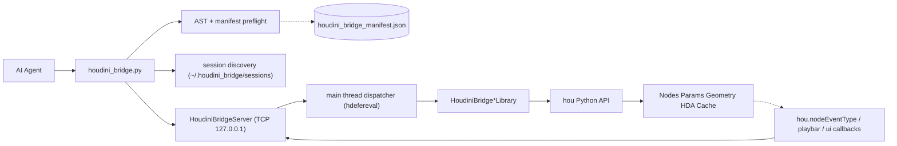

# Architecture

## Overview

Houdini Assistant Bridge is split across two processes that communicate over
the loopback interface only.

```text
+----------------------+        loopback TCP        +-----------------------------+
|   Agent host (CLI)   |  <----------------------> |        Houdini process       |
|                      |   length-prefixed JSON     |                              |
|  houdini_bridge.py   |                            |  houdini_bridge_autoload.py |
|  AST + manifest      |                            |  HoudiniBridgeServer        |
|  preflight           |                            |  Dispatcher (main thread)   |
|                      |                            |  Typed libraries (hou API)  |
+----------------------+                            +-----------------------------+
```



## Houdini side

### Bootstrap

Houdini package loading happens in two phases:

1. The **package descriptor** `plugin/packages/houdini_bridge.json` is read
   first; its `env` block injects `HOUDINI_BRIDGE_ROOT`, prepends
   `$HOUDINI_BRIDGE_ROOT/python` to `PYTHONPATH`, and prepends
   `$HOUDINI_BRIDGE_ROOT` to `HOUDINI_PATH`.
2. After every `HOUDINI_PATH` entry is registered, Houdini scans each
   `scripts/` subdirectory for the **lifecycle hooks**:
   - `scripts/123.py` runs once when Houdini starts without a hip.
   - `scripts/456.py` runs once when a hip file finishes loading.

   Both hooks call `import houdini_bridge; houdini_bridge.start()`. The bridge
   is idempotent so re-entry is safe. They also no-op when
   `HOUDINI_BRIDGE_DISABLE=1`.

> Note: the `python3.X libs/` directories *only* extend `sys.path`; modules
> placed there are not auto-imported. The lifecycle hooks above are the
> mechanism that actually starts the server.

The bridge registers `atexit` cleanup as well as a `hou.session.houdini_bridge_stop`
hook so a session can shut the server down explicitly.

### Server

`houdini_bridge.server.HoudiniBridgeServer` runs a background `socketserver`
loop that:

- Binds `127.0.0.1` on an OS-assigned port (override via
  `HOUDINI_BRIDGE_PORT`).
- Reads framed JSON requests (4-byte big-endian length + UTF-8 body).
- Hands each request to `HoudiniBridgeDispatcher.execute()` which posts a
  callable into Houdini's main thread via `hdefereval.executeInMainThreadWithResult`
  and waits for the result on the worker thread.
- Returns a framed JSON response with `{id, success, output, error, result}`.

### Dispatcher

`houdini_bridge.dispatcher.MainThreadDispatcher` wraps `hdefereval` with a
fallback for headless / non-UI Houdini sessions where main-thread dispatch is
not required. The dispatcher is also responsible for capturing stdout/stderr
during `exec` requests.

### Registry

`houdini_bridge.registry.Registry` discovers every `HoudiniBridge*Library`
module under `houdini_bridge.libraries` at import time, builds a
`{library_name: {function_name: callable}}` map, and exposes metadata for the
manifest generator.

### Undo

Every write op uses the helper `with houdini_bridge.undo.group("label"):`
which forwards to `hou.undos.group(label)`. The helper is a no-op when `hou`
is not available (e.g. when libraries are imported under the standalone
manifest generator).

### Discovery

`houdini_bridge.discovery.write_session_descriptor(...)` writes a JSON file at
`~/.houdini_bridge/sessions/<pid>.json` containing:

```json
{
  "schema": 1,
  "session_id": "uuid",
  "pid": 12345,
  "host": "127.0.0.1",
  "port": 49321,
  "hip": "C:/work/scene.hip",
  "hfs": "C:/Program Files/Side Effects Software/Houdini 20.5.123",
  "houdini_version": "20.5.123",
  "started_at": "2026-05-08T12:34:56Z"
}
```

The file is removed on graceful shutdown; the CLI ignores stale files whose
`pid` no longer responds to `ping`.

## Agent side

### CLI

`agent/skills/houdini-bridge/scripts/houdini_bridge.py` is a single-file CLI
with subcommands:

| Command          | Purpose                                                     |
| ---------------- | ----------------------------------------------------------- |
| `ping`           | Verify a session responds                                   |
| `list-sessions`  | List all live sessions discovered locally                   |
| `exec <code>`    | Run inline Python (preflight first)                         |
| `exec-file path` | Run a Python file (preflight first)                         |
| `call lib fn`    | Structured call into a typed library function               |
| `manifest`       | Print, regenerate, or validate the manifest                 |

### Preflight

`scripts/_preflight.py` parses the supplied script via `ast`, walks the tree,
and validates every call of the form `hou_bridge.<library>.<function>(...)`
or `houdini_bridge_call("<library>", "<function>", ...)` against the
manifest:

- unknown library / function (with did-you-mean using `difflib`)
- unknown kwargs
- missing required positional args
- destructive ops without `--allow destructive`

Any failure is reported locally before the request is sent.

### Manifest

`tools/gen_manifest.py` imports the `houdini_bridge.libraries` package without
Houdini, walks every module that exposes a `LIBRARY` constant, runs
`inspect.signature` on each public function, and emits
`agent/skills/houdini-bridge/manifest/houdini_bridge_manifest.json`.

The manifest is the single source of truth for both the preflight and the
generated `references/` docs.

## Threading model

- HOM is **not** thread-safe. All work that touches `hou` runs on Houdini's
  main thread through the dispatcher.
- Network IO happens on a worker thread spun by `socketserver.ThreadingMixIn`.
- Long-running cooks should release the main thread between steps; libraries
  default to short, structured operations and surface async cook handles
  rather than blocking forever.

## Cross-version support

| Houdini | Python | Notes                                    |
| ------- | ------ | ---------------------------------------- |
| 19.5    | 3.9    | minimum supported                        |
| 20.0    | 3.10   |                                          |
| 20.5    | 3.10   | development reference                    |
| 21.0    | 3.11   | preview                                  |

Auto-start uses `scripts/123.py` and `scripts/456.py`, which are picked up
regardless of the Python version Houdini ships with. The Python package itself
lives under `plugin/python/houdini_bridge/` and is added to every supported
interpreter via `PYTHONPATH`.

## Future extensions

- MCP server façade that wraps the same library surface for tools that prefer
  MCP over a custom CLI.
- UDP discovery for headless render hosts.
- Trace / perf channel for profiling bridge calls and long-running Houdini ops.
